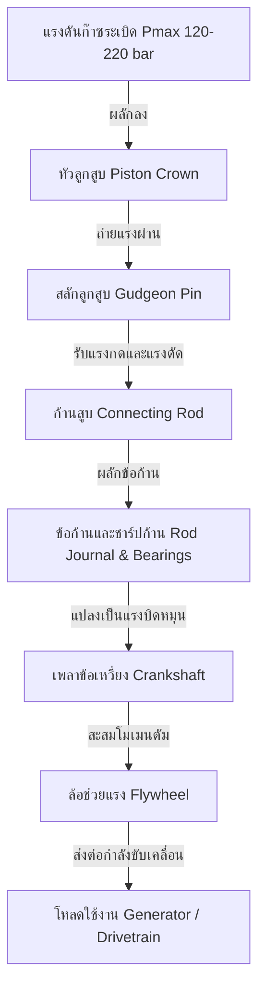
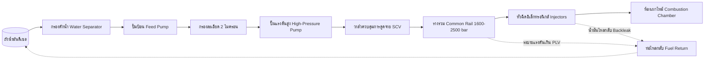
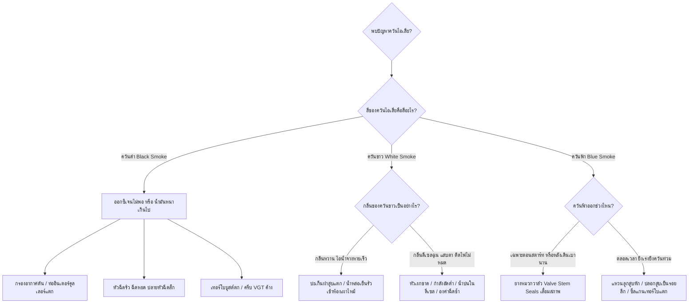

# 🚜 Diesel Engine Engineering Masterclass & Diagnostic Compendium
> **คู่มือแม่บทวิศวกรรมเครื่องยนต์ดีเซล: สถาปัตยกรรม 2 โครงสร้าง + 6 ระบบ, วัฏจักร 4 จังหวะ, การวิเคราะห์ปัญหา 30 อาการหลัก และรหัสวิเคราะห์ DTC / SAE J1939**

[](https://username.github.io/diesel-engine-mastery/)
[](LICENSE)
[](#)
[](#)

---

## 📖 สารบัญภาพรวม (Table of Contents)
1. [สถาปัตยกรรมแม่บท: 2 โครงสร้างหลัก + 6 ระบบสนับสนุน](#-สถาปัตยกรรมแม่บท-2-โครงสร้างหลัก--6-ระบบสนับสนุน)
2. [วัฏจักรการทำงาน 4 จังหวะเชิงลึก (720° Crank Angle)](#-วัฏจักรการทำงาน-4-จังหวะเชิงลึก)
3. [ไดอะแกรมการทำงานด้วย Mermaid.js](#-ไดอะแกรมการทำงาน-mermaidjs)
4. [ตารางวิเคราะห์ปัญหาเร่งด่วน (Quick Diagnostic Reference)](#-ตารางวิเคราะห์ปัญหาเร่งด่วน)
5. [ระบบเว็บแอปพลิเคชันแบบ Interactive (GitHub Pages)](#-ระบบเว็บแอปพลิเคชันแบบ-interactive)
6. [เครื่องมือ Python CLI สำหรับการวินิจฉัยและคำนวณ](#-เครื่องมือ-python-cli)
7. [เอกสารประกอบฉบับเต็มในโฟลเดอร์ docs/](#-เอกสารประกอบฉบับเต็ม)

---

## 🏗️ สถาปัตยกรรมแม่บท: 2 โครงสร้างหลัก + 6 ระบบสนับสนุน

```
                             ┌───────────────────────────────────────────────┐
                             │       DIESEL ENGINE ARCHITECTURE              │
                             └───────────────────────┬───────────────────────┘
                                                     │
                 ┌───────────────────────────────────┴───────────────────────────────────┐
                 │                                                                       │
┌────────────────┴────────────────┐                                     ┌────────────────┴────────────────┐
│   2 CORE MECHANISMS (โครงสร้าง) │                                     │   6 AUXILIARY SYSTEMS (ระบบ)    │
├─────────────────────────────────┤                                     ├─────────────────────────────────┤
│ 1. Crank-Connecting Rod         │                                     │ 1. Air Intake & Turbocharging   │
│    (กลไกเพลาข้อเหวี่ยงและก้านสูบ)   │                                     │ 2. Exhaust & Backpressure       │
│ 2. Valve Train Mechanism        │                                     │ 3. Common Rail Fuel Injection   │
│    (กลไกควบคุมการเปิด-ปิดวาล์ว)   │                                     │ 4. Engine Lubrication           │
└─────────────────────────────────┘                                     │ 5. Engine Cooling               │
                                                                        │ 6. Starting & Electrical / ECU  │
                                                                        └─────────────────────────────────┘
```

---

## 🔄 วัฏจักรการทำงาน 4 จังหวะเชิงลึก

| จังหวะ | องศาเพลา (CAD) | สถานะวาล์ว | แรงดันในสูบ | อุณหภูมิ | ปรากฏการณ์อุณหพลศาสตร์ |
| :--- | :---: | :---: | :---: | :---: | :--- |
| **1. ดูด (Intake)** | 0° - 180° | ไอดีเปิด / ไอเสียปิด | 0.9 - 3.5 bar (Boost) | 30°C - 50°C | ดูดเฉพาะอากาศบริสุทธิ์ที่มีออกซิเจนสูง |
| **2. อัด (Compression)** | 180° - 360° | ปิดสนิททั้งคู่ | 35 - 55 bar | 550°C - 800°C | อัดอากาศจนร้อนเกินจุดติดไฟดีเซล |
| **- ฉีด (Injection)** | 345° - 360° | ปิดสนิททั้งคู่ | สะสมความดัน | 600°C - 750°C | Ignition Delay Period (หน่วงเวลาลุกไหม้) |
| **3. ระเบิด (Power)** | 360° - 540° | ปิดสนิททั้งคู่ | 120 - 220+ bar (Pmax) | 1,800°C - 2,200°C | เกิดแรงดันผลักหัวลูกสูบ ผลิตแรงบิด |
| **4. คาย (Exhaust)** | 540° - 720° | ไอดีปิด / ไอเสียเปิด | 2.0 - 4.5 bar | 450°C - 650°C | ระบายก๊าซเสียไปปั่นใบพัดเทอร์ไบน์ |

---

## 📊 ไดอะแกรมการทำงาน (Mermaid.js)

### 1. เส้นทางการส่งถ่ายแรงในกลไกเพลาข้อเหวี่ยง (Force Transmission Path)


### 2. วงจรระบบเชื้อเพลิงคอมมอนเรล (Common Rail Fuel Circuit)


### 3. ต้นไม้วินิจฉัยสีควันไอเสีย (Smoke Diagnostic Decision Tree)


---

## ⚡ ตารางวิเคราะห์ปัญหาเร่งด่วน (Quick Diagnostic Reference)

| อาการเสีย (Symptom) | สาเหตุรากเหง้าที่เป็นไปได้สูงสุด (Top Root Causes) | เครื่องมือที่ต้องใช้ตรวจ | จุดลงมือแก้ไขทันที |
| :--- | :--- | :--- | :--- |
| **สตาร์ทเงียบ บิดกุญแจไม่มีเสียง** | 1. ขี้เกลือขั้วแบตเตอรี่<br>2. แรงดันแบตเตอรี่ < 12.4V<br>3. รีเลย์/โซลินอยด์สตาร์ทไหม้ | มัลติมิเตอร์ / Battery Tester | ขัดขั้วแบตเตอรี่, เติมประจุไฟ, เคาะโซลินอยด์เบาๆ |
| **ไดสตาร์ทหมุน แต่เครื่องไม่ติด** | 1. มีอากาศในระบบน้ำมัน (Air Ingress)<br>2. กรองดีเซลตัน<br>3. เซนเซอร์ข้อเหวี่ยงเสีย | ประแจเบอร์ 10/17 / OBD Scanner | ปั๊มแย๊กมือไล่ลม, เปลี่ยนกรองดีเซล, ตรวจวัดเซนเซอร์ CKP |
| **ควันดำ เร่งไม่ออก บูสต์ไม่มา** | 1. ท่อยางอินเตอร์คูลเลอร์แตก/หลุด<br>2. กรองอากาศตัน<br>3. ครีบเทอร์โบแปรผันติดขัด | เกจวัดบูสต์ / สโมกเทสเตอร์ | เปลี่ยนท่อยางอินเตอร์คูลเลอร์, เป่ากรอง, ล้างเขม่า VGT |
| **น้ำมันเครื่องกลายเป็นสีกาแฟใส่นม** | 1. ออยล์คูลเลอร์น้ำมันเครื่องแตกทะลุ<br>2. ปะเก็นฝาสูบรั่ว | เครื่องวัดแรงดันหม้อน้ำ | **ห้ามสตาร์ทเครื่อง!** เปลี่ยนไส้ออยล์คูลเลอร์ ฟลัชชิ่งน้ำมันใหม่ |
| **เสียงเคาะตึ้กๆ หนักแน่นใต้ท้องเครื่อง** | 1. ชาร์ปอกหรือชาร์ปก้านละลาย (Rod Knock)<br>2. แรงดันน้ำมันเครื่องตกวิกฤต | สเต็ทโทสโคป / เกจวัดแรงดันน้ำมัน | **ดับเครื่องทันที!** รื้อเปิดอ่างตรวจชาร์ป ป้องกันก้านสูบขาด |

---

## 🌐 ระบบเว็บแอปพลิเคชันแบบ Interactive (GitHub Pages)

โปรเจกต์นี้มาพร้อมกับไฟล์ `index.html` ซึ่งเป็นเว็บแอป Single Page Application แบบพกพาที่ทำงานได้ทันทีบน **GitHub Pages** โดยไม่ต้องติดตั้ง Dependencies ใดๆ:
- 🔍 **Live Diagnostic Search:** ค้นหาอาการเสียและวิธีซ่อมแบบเรียลไทม์จาก 30 อาการ
- 📟 **DTC & J1939 Code Lookup:** ค้นหารหัสไฟโชว์ เช่น `P0087`, `P0299`, `P0524` พร้อมขั้นตอนแก้ไข
- 🧮 **Engineering Calculators:** โปรแกรมคำนวณอัตราส่วนกำลังอัด (CR), BMEP, แรงม้าเบรก (Brake kW/HP), และอัตราสิ้นเปลือง BSFC
- ⏱️ **Interactive 4-Stroke Engine Simulator:** ซิมูเลเตอร์จำลองการเคลื่อนที่ของลูกสูบและวาล์วทั้ง 4 จังหวะ

### วิธีเปิดใช้งาน GitHub Pages:
1. เข้าไปที่ **Repository Settings** > **Pages**
2. ภายใต้ **Build and deployment** > Source เลือก **Deploy from a branch**
3. เลือก Branch `main` และโฟลเดอร์ `/(root)` หรือ `/docs` แล้วกด **Save**
4. เว็บแอปจะออนไลน์พร้อมใช้งานได้ทั่วโลกทันที!

---

## 💻 เครื่องมือ Python CLI (cli_diagnostics.py)

หากต้องการรันโปรแกรมตรวจสอบและวินิจฉัยบน Terminal:
```bash
# ค้นหาอาการเสีย
python3 cli_diagnostics.py search "ควันดำ"

# ตรวจสอบรหัสวิเคราะห์ DTC
python3 cli_diagnostics.py dtc P0087

# คำนวณค่าทางวิศวกรรม (เช่น Compression Ratio)
python3 cli_diagnostics.py calc cr --bore 85 --stroke 95 --clearance_vol 30
```

---

## 📁 เอกสารประกอบฉบับเต็มในโฟลเดอร์ docs/
- [`docs/01_architecture_overview.md`](docs/01_architecture_overview.md) : สถาปัตยกรรมเครื่องยนต์ดีเซล 2 กลไก + 6 ระบบ
- [`docs/02_four_stroke_thermodynamics.md`](docs/02_four_stroke_thermodynamics.md) : ทฤษฎีอุณหพลศาสตร์และวัฏจักร 4 จังหวะ 720°
- [`docs/03_two_core_mechanisms.md`](docs/03_two_core_mechanisms.md) : กลไกเพลาข้อเหวี่ยง-ก้านสูบ และกลไกวาล์ว
- [`docs/04_six_auxiliary_systems.md`](docs/04_six_auxiliary_systems.md) : เจาะลึก 6 ระบบสนับสนุนการทำงาน
- [`docs/05_troubleshooting_matrix.md`](docs/05_troubleshooting_matrix.md) : คู่มือวิเคราะห์ปัญหาและอาการเสีย 30 อาการ
- [`docs/06_dtc_and_j1939_codes.md`](docs/06_dtc_and_j1939_codes.md) : รหัสวิเคราะห์ปัญหามาตรฐาน OBD-II และ SAE J1939
- [`docs/07_preventive_maintenance.md`](docs/07_preventive_maintenance.md) : ตารางการซ่อมบำรุงเชิงป้องกันและการตรวจวิเคราะห์สภาพน้ำมัน
- [`docs/08_content_production_playbook.md`](docs/08_content_production_playbook.md) : พิมพ์เขียวการสร้างคอนเทนต์วิดีโอไวรัลและสคริปต์ตัวอย่าง

---

## 📄 License
This project is licensed under the MIT License - see the [LICENSE](LICENSE) file for details.
